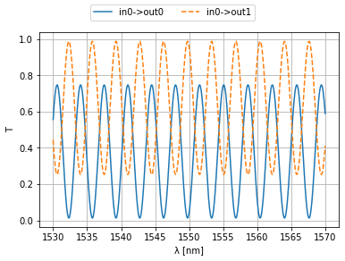

# SAX

> 0.18.2


SAX: S-Matrices with Autograd and XLA - a scatter parameter circuit simulator and
optimizer for the frequency domain based on [JAX](https://github.com/google/jax).

The simulator was developed for simulating Photonic Integrated Circuits but in fact is
able to perform any S-parameter based circuit simulation. The goal of SAX is to be a
thin wrapper around JAX with some basic tools for S-parameter based circuit simulation
and optimization. Therefore, SAX does not define any special datastructures and tries to
stay as close as possible to the functional nature of JAX. This makes it very easy to
get started with SAX as you only need functions and standard python dictionaries. Let's
dive in...

## Quick Start

[Full Quick Start page](https://gdsfactory.github.io/sax/nbs/examples/01_quick_start) - [Documentation](https://gdsfactory.github.io/sax).

Let's first import the SAX library, along with JAX and the JAX-version of numpy:

```python
import sax
import jax
import jax.numpy as jnp
```

Define a model function for your component. A SAX model is just a function that returns
an 'S-dictionary'. For example a directional coupler:

```python
def coupler(coupling=0.5):
    kappa = coupling**0.5
    tau = (1-coupling)**0.5
    sdict = sax.reciprocal({
        ("in0", "out0"): tau,
        ("in0", "out1"): 1j*kappa,
        ("in1", "out0"): 1j*kappa,
        ("in1", "out1"): tau,
    })
    return sdict

coupler(coupling=0.3)
```

    {('in0', 'out0'): 0.8366600265340756,
     ('in0', 'out1'): 0.5477225575051661j,
     ('in1', 'out0'): 0.5477225575051661j,
     ('in1', 'out1'): 0.8366600265340756,
     ('out0', 'in0'): 0.8366600265340756,
     ('out1', 'in0'): 0.5477225575051661j,
     ('out0', 'in1'): 0.5477225575051661j,
     ('out1', 'in1'): 0.8366600265340756}

Or a waveguide:

```python
def waveguide(wl=1.55, wl0=1.55, neff=2.34, ng=3.4, length=10.0, loss=0.0):
    dwl = wl - wl0
    dneff_dwl = (ng - neff) / wl0
    neff = neff - dwl * dneff_dwl
    phase = 2 * jnp.pi * neff * length / wl
    amplitude = jnp.asarray(10 ** (-loss * length / 20), dtype=complex)
    transmission =  amplitude * jnp.exp(1j * phase)
    sdict = sax.reciprocal({("in0", "out0"): transmission})
    return sdict

waveguide(length=100.0)
```

    {('in0', 'out0'): 0.97953-0.2013j, ('out0', 'in0'): 0.97953-0.2013j}

These component models can then be combined into a circuit:

```python
mzi, _ = sax.circuit(
    netlist={
        "instances": {
            "lft": coupler,
            "top": waveguide,
            "rgt": coupler,
        },
        "connections": {
            "lft,out0": "rgt,in0",
            "lft,out1": "top,in0",
            "top,out0": "rgt,in1",
        },
        "ports": {
            "in0": "lft,in0",
            "in1": "lft,in1",
            "out0": "rgt,out0",
            "out1": "rgt,out1",
        },
    }
)

type(mzi)
```

    function

As you can see, the mzi we just created is just another component model function! To simulate it, call the mzi function with the (possibly nested) settings of its subcomponents. Global settings can be added to the 'root' of the circuit call and will be distributed over all subcomponents which have a parameter with the same name (e.g. 'wl'):

```python
wl = jnp.linspace(1.53, 1.57, 1000)
result = mzi(wl=wl, lft={'coupling': 0.3}, top={'length': 200.0}, rgt={'coupling': 0.8})

plt.plot(1e3*wl, jnp.abs(result['in0', 'out0'])**2, label="in0->out0")
plt.plot(1e3*wl, jnp.abs(result['in0', 'out1'])**2, label="in0->out1", ls="--")
plt.xlabel("λ [nm]")
plt.ylabel("T")
plt.grid(True)
plt.figlegend(ncol=2, loc="upper center")
plt.show()
```



Those are the basics. For more info, check out the **full**
[SAX Quick Start page](https://gdsfactory.github.io/sax/nbs/examples/01_quick_start) or the rest of the [Documentation](https://gdsfactory.github.io/sax).

## Installation

SAX requires Python >=3.12. kfnetlist is a required dependency and provides the
canonical netlist format for circuit construction. See the
[native netlist migration guide](docs/native-netlists.md) for placed extraction,
model identity, PIC loading, and forward-backend removal. Install it with pip:

```sh
pip install sax
```

KLU is the default circuit backend. Its solver package `klujax` is a required
SAX dependency and is installed automatically; there is no missing-KLU fallback.

Published dependencies currently resolve on macOS ARM64, Linux x86-64/ARM64,
and Windows x86-64. Intel macOS lacks a compatible klujax wheel; native Windows
ARM64 lacks a kfnetlist wheel. Other platform/runtime combinations have not been
verified. See [verification details](docs/native-netlists.md#installation-verification).

For development and the example notebooks, clone the repository and install its
locked dependency groups with [uv](https://docs.astral.sh/uv/). Python 3.12 is used
for the development environment and optional netlist test fixtures:

```sh
git clone https://github.com/gdsfactory/sax.git
cd sax
uv sync --locked --python 3.12 --dev
```

Development dependencies are repository dependency groups, not a `sax[dev]` extra.
Use `just smoke` for fast numerical checks in the installed environment and
`just test` for the full suite (including notebook kernel setup). Smoke reuses a
JAX compilation cache under `.venv` and disables optional pytest plugins; the
first run fills the cache and can take longer than subsequent runs.

## License

Copyright © 2025, Floris Laporte, [Apache-2.0 License](https://github.com/gdsfactory/sax/blob/main/LICENSE)
